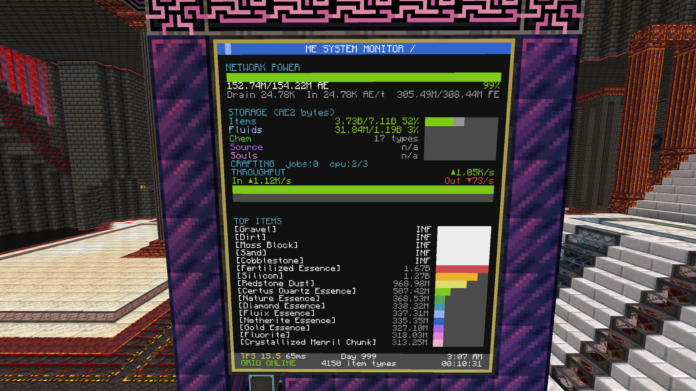
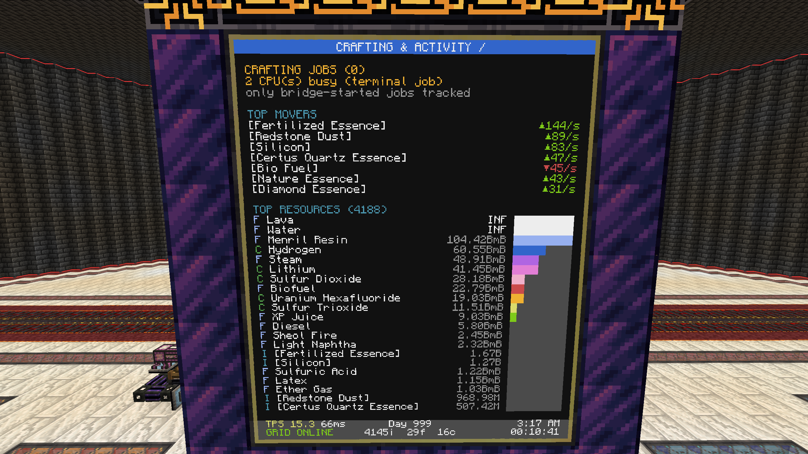

# AE2 CC Resource Monitor

A real-time **Applied Energistics 2 resource dashboard** for **CC: Tweaked**, rendered on a resizable wall of Advanced Monitors through an **Advanced Peripherals ME Bridge**.

The monitor displays AE network power, storage usage, item/fluid/chemical totals, active crafting, resource throughput, top movers, server TPS, uptime, and more. A second connected monitor is automatically used as a dedicated **Crafting & Activity** display.

Tested with **All the Mods 10 v5.3.1**.





## Features

- Smooth 10 FPS animated interface
- Automatically resizes to the attached monitor dimensions
- Single-monitor and dual-monitor layouts
- AE power stored, capacity, drain, and average input
- FE equivalent display for Applied Flux-backed power storage
- Item, fluid, and chemical storage-byte usage
- Optional Source and Soul storage-cell detection
- Active crafting-job and crafting-CPU status
- Item input, output, and net throughput
- Historical throughput graph
- Top resource movers by items per second
- Ranked item, fluid, and chemical lists
- Infinite/void-cell detection
- AE grid online/offline alerts with automatic reconnection
- TPS, approximate MSPT, Minecraft day, time, uptime, and optional player count
- Runtime ME Bridge API detection and compatibility fallbacks
- Automatic `bridge_methods.txt` diagnostic dump

## Tested Versions

| Component | Version |
|---|---:|
| Minecraft | 1.21.1 |
| Mod loader | NeoForge |
| All the Mods 10 | 5.3.1 |
| Applied Energistics 2 | 19.2.17 |
| Advanced Peripherals | 0.7.57b |
| CC: Tweaked | 1.116.2 |
| Applied Flux | 2.1.4 |

Other versions may work because the script checks the ME Bridge's available methods at runtime and supports several fallback method names, but they have not been tested.

## Requirements

- One **Advanced Computer**
- One **ME Bridge** from Advanced Peripherals, attached to the AE2 network
- One **Advanced Monitor** wall; a second monitor wall is optional
- A working Applied Energistics 2 network
- Wired modems and networking cable when peripherals are not directly adjacent
- Applied Flux only if FE-backed AE network power storage is desired
- Optional Player Detector for the online-player count

The screenshots use a **5 × 6 Advanced Monitor wall**. The script is resizable and can run on other dimensions, although very small displays may omit some information.

## Installation

### Pastebin

On the Advanced Computer, run:

```lua
pastebin get rytCc78y startup
```

Then start it immediately with:

```lua
startup
```

Because the program is named `startup`, CC: Tweaked launches it automatically whenever the computer boots or reboots.

The source is also available at:

```text
https://pastebin.com/rytCc78y
```

### Manual installation

1. Copy the Lua source from this repository onto the Advanced Computer.
2. Save it as `startup` so CC: Tweaked runs it automatically at boot.
3. Run it with:

```lua
startup
```

## Hardware Setup

Place the **ME Bridge directly against the AE2 network** so it joins the grid. Like other AE2 network devices, the bridge uses **one AE channel**, so make sure the cable or subnet it is attached to has a free channel.

A minimal single-monitor setup is:

```text
AE2 Network ── ME Bridge
                    │
             Advanced Computer ── Advanced Monitor Wall
```

The computer, ME Bridge, and monitor do not all need to be physically adjacent. Wired modems can place them on one CC: Tweaked peripheral network:

```text
[ME Bridge]
     │
[Wired Modem]════════ Networking Cable ════════[Wired Modem]
                                                    │
                                            [Advanced Computer]
                                                    │
                                            [Monitor Wall]
```

For two monitor walls, connect both monitors to the same wired peripheral network:

```text
                         ┌── [Wired Modem] ── [5×6 Primary Monitor]
[Computer + Modem] ══════┼── [Wired Modem] ── [5×6 Secondary Monitor]
                         └── [Wired Modem] ── [ME Bridge]
```

Right-click every wired modem attached to a peripheral. Its message should confirm that the peripheral has been connected to the network.

The second monitor is optional. Supported arrangements include:

- One monitor wall of any reasonable size
- Two separate monitor walls connected through wired modems
- Two **5×6 monitor walls placed directly next to each other** for a side-by-side dashboard
- A single extra-wide monitor wall, which automatically uses the script's two-column layout

The script searches automatically for:

```lua
peripheral.find("me_bridge")
peripheral.find("monitor")
```

When two distinct monitor peripherals are detected, one is used for the main **ME System Monitor** and the other for **Crafting & Activity**. No second monitor is required.

> **Important:** Two monitor walls touching each other can merge into one larger monitor peripheral. This is supported, but it will be treated as one wide display. To keep them as two independent 5×6 screens, leave a gap between them or separate them so Minecraft does not merge the monitor blocks.

## Configuration

The main options are near the top of the script:

```lua
local CONFIG = {
    monitorTextScale = 1.0,
    pollInterval     = 2,
    frameRate        = 10,
    topItemCount     = 20,
    aeToFe           = 2,
    barEase          = 0.20,
    sparkSamples     = 64,
    sparkRows        = 3,
    twoColMinWidth   = 64,
    tpsAvgSamples    = 5,
    primaryMonitor   = nil,
    dumpMethods      = true,
}
```

### Pinning the primary monitor

With multiple monitors attached, set the peripheral name explicitly:

```lua
primaryMonitor = "monitor_0"
```

To view attached peripheral names, run:

```lua
peripherals
```

### Changing the AE-to-FE conversion

The tested configuration uses:

```lua
aeToFe = 2
```

Adjust this value if the conversion used by your modpack differs.

### Source and Soul storage detection (WIP)

The script identifies special storage cells using name fragments:

```lua
sourceMatch = { "source", "arseng", "ars_eng", "energistique" }
soulMatch   = { "soul" }
```

Add or change strings here when an addon uses different registry names.

## Display Behavior

### One monitor

Only one monitor is required. A single sufficiently wide monitor uses a two-column dashboard, while a narrower monitor falls back to a stacked layout.

### Two monitors

A second monitor is optional. When two separate monitor peripherals are detected:

- **Primary monitor:** power, storage, crafting summary, throughput, and top items
- **Secondary monitor:** crafting jobs, top movers, and combined item/fluid/chemical resources

The two screens may be located apart and linked with wired modems, or placed physically side by side. Two touching monitor walls may merge into one wide peripheral; this is also supported, but it uses the single-monitor two-column layout instead of the dedicated secondary screen.

## ME Bridge Compatibility

The script builds its API bindings from the methods actually exposed by the installed ME Bridge. Tested methods and fallbacks include:

| Function | Preferred method | Fallback |
|---|---|---|
| Items | `getItems` | `listItems` |
| Fluids | `getFluids` | `listFluids` |
| Chemicals | `getChemicals` | `listChemicals` |
| Cells | `getCells` | `listCells` |
| Stored energy | `getStoredEnergy` | `getEnergyStorage` |
| Energy capacity | `getEnergyCapacity` | `getMaxEnergyStorage` |
| Average energy input | `getAverageEnergyInput` | `getAvgPowerInjection` |
| Crafting tasks | `getCraftingTasks` | — |
| Crafting CPUs | `getCraftingCPUs` | — |

When `dumpMethods` is enabled, the program writes all detected methods to:

```text
bridge_methods.txt
```

This file is useful when diagnosing compatibility with another Advanced Peripherals build.

## Known Limitations

- The script's TPS/MSPT display is estimated from CC: Tweaked timer behavior; it is not a direct server tick profiler.
- Advanced Peripherals may only expose detailed progress for crafting jobs started through supported bridge APIs. Terminal-started jobs may appear only as busy crafting CPUs.
- Source and Soul capacity detection depends on addon cell names and the fields returned by `getCells()`.
- Applied Flux FE values are derived from AE energy values using the configured `aeToFe` multiplier.
- Very small monitor layouts cannot display every dashboard section simultaneously.

## Troubleshooting

### `no monitor found`

Confirm that an Advanced Monitor is directly attached or connected through an enabled wired modem.

### `WAITING FOR ME BRIDGE`

Confirm that:

- The ME Bridge is attached to the computer's peripheral network.
- Wired modems are enabled.
- The bridge is connected to the AE2 network.
- The peripheral type is visible through `peripherals`.

### `SYSTEM OFFLINE`

The bridge is present, but the AE network is reporting offline or disconnected. Check the controller, channels, power, and ME Bridge connection.

### Item data unavailable

Inspect `bridge_methods.txt` and confirm that the installed Advanced Peripherals version exposes `getItems` or `listItems`.

### Wrong monitor selected

Set `CONFIG.primaryMonitor` to the desired monitor's peripheral name.

### Text is too large or too small

Change:

```lua
monitorTextScale = 1.0
```

Common values are `0.5`, `1.0`, `1.5`, and `2.0`, depending on the monitor size and desired density.

## Repository Layout

```text
AE2-CC-resource-monitor/
├── README.md
├── ae2_resource_monitor.lua
├── 2026-06-23_00.41.29.png
└── 2026-06-23_00.41.40.png
```

## License

MIT
